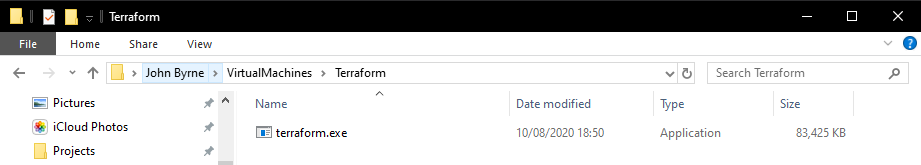

# Infrastructure as Code with Terraform

### To install Terraform we did the following:

### Step 1

Download Terraform. [**Windows**](https://releases.hashicorp.com/terraform/0.13.0/terraform_0.13.0_windows_amd64.zip) | [**Mac**](https://releases.hashicorp.com/terraform/0.13.0/terraform_0.13.0_darwin_amd64.zip) | [**Site**](https://www.terraform.io/downloads.html)

### Step 2

Unzip the folder, place it somewhere for example a folder inside Users called _**Terraform**_ then copy that directory location. 

```clipboard
C:\Users\<user>\VirtualMachines\Terraform
```



## Step 3

1. Now navigate to your environment variables if you are on Windows. (search in start menu)
2. Inside that select the **Advanced** tab and select the **environmental variables..** option at the bottom.
3. Inside there in the _User Variables_ double click **Path** variables and then in the new window click **New** and add that path you copied into the new variable slot.
4. To check it has been installed close any/ all bash instances you have running and then reopen one in administrator and type:

```bash
# Check if the terraform is installed
terraform --version
```


### What is Terraform?

_**There are 2 sides of IAC**_

1. Configuration Management
2. Orchestration Tool

* **Ansible** - Configuration management
* **Terraform** - Orchestration
* **Kubernetes** - Orchestration is used in containerisation - i.e. Docker, Crio, Rocket.

### Terraform?

1. Orchestration tools to configure out instances and their AWS configurations remotely.
2. Terraform files are created with .`tf` extension 
3. Set Environment variables, via `Environmental variables` and add the `ACCESS` and `SECRET` Keys as user variables. Terraform will automatically pick them up.
4. Make sure you refresh any current instances of `Git Bash` you have running as the environmental variables will not take effect until you have done that. Find the commands to create the instance [below](#Terraform-Commands).

### Terraform Commands:

```bash
terraform init
```

```bash
# Check the steps inside the code
# lists either 'SUCCESS' or 'ERROR'
terraform plan
```

```bash
# This runs after everything has been checked 
# Immplements the code (Deploy the infrastructure)
terraform apply
```

The [Terraform Registry](https://registry.terraform.io/) is amazingly written, it is informative and has many examples.

